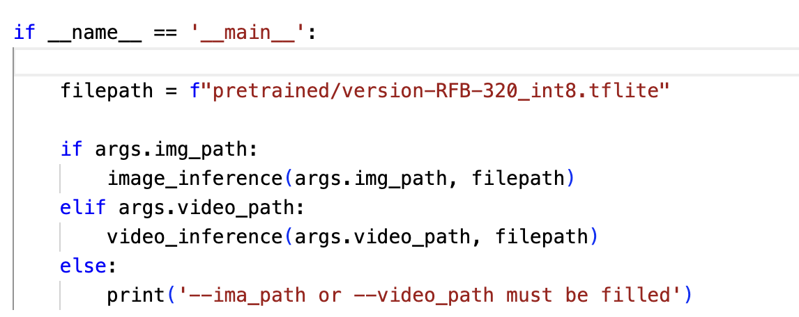

# face-recognition-nxp
Face Recognition on NXP board, using TFLite 8bit model for face detection

## Prepare Development Environment

If Linux OS

``` sh
conda env create -f tensorflow_env_linux.yaml -n tensorflow
```

If MAC OS M1

``` sh
conda env create -f tensorflow_env_macos.yaml -n tensorflow
```

## Convert ONNX model to TFLite model

Follow the instruction in the file `src/onnx_to_tflite.ipynb` to convert the ONNX model to TFLite model.


## Run the demo

1. Copy the TFLite model from result folder to the `models/tflite8bit` folder.
2. Change the directory to the model in the file `src/run_inference.py`.

3. Run the demo by the command 

``` sh
# inference with video
python3 run_inference.py --video_path <video_path>
```

``` sh
# inference with image
python3 run_inference.py --image_path <image_path>
```